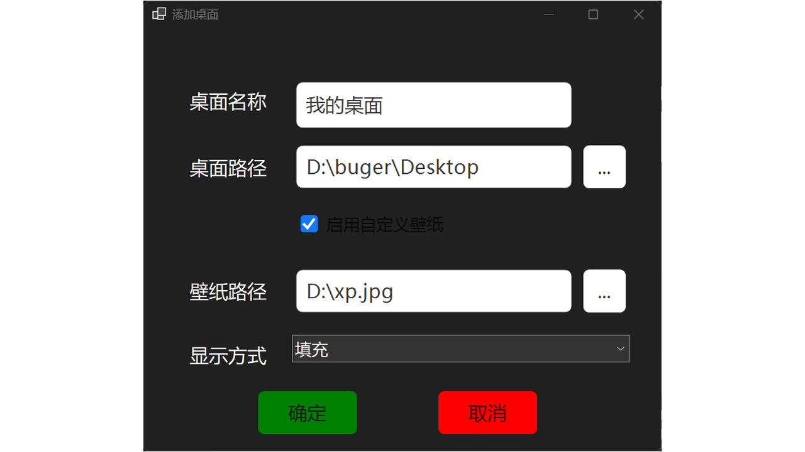
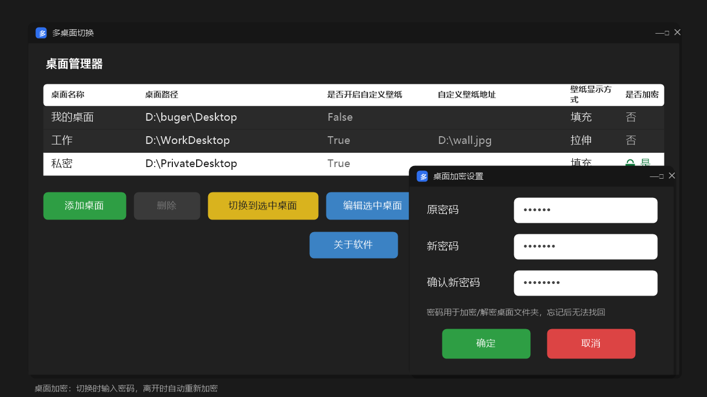

# MultiDesktop — Windows 多桌面切换管理


一款基于 .NET 10 的 Windows 多桌面管理工具。通过 Win32 Shell API 修改桌面文件夹路径，实现多个虚拟桌面之间的一键切换——每个"桌面"拥有独立的文件夹，互不干扰，切换无需重启资源管理器。

> 支持 **桌面加密**：可以为任意桌面设置密码，切换时需输入密码解锁，离开时自动重新加密，保护你的私密文件。

---

## ✨ 功能特性

- **一键切换桌面**：通过 `SHSetKnownFolderPath` 无感切换桌面文件夹，explorer 自动刷新，无需重启
- **自定义壁纸**：每个桌面可设置独立的壁纸与显示方式（填充/适应/拉伸/平铺/居中/跨屏）
- **🔒 桌面加密**：为桌面设置密码后，文件夹被压缩加密（基于后量子密码学文件加密库），切换时输入密码解锁，离开时自动重新加密
- **系统托盘**：最小化到托盘，右键菜单快速切换桌面
- **CLI 支持**：添加 / 删除 / 列出桌面，设置壁纸与加密均可通过命令行完成
- **深色 / 浅色主题**：跟随系统或手动切换

---

## 🚀 快速开始

### 运行环境

- Windows 10 (build 14393) 及以上
- .NET 10 运行时（或直接使用免安装发布版）

### 安装

1. 从 [Releases](https://github.com/Qibowen2008/MultiDesktop/releases) 下载最新版本（支持 x86 / x64 / ARM / ARM64，可打包 MSIX）
2. 解压后运行 `MultiDesktop.exe`
3. 首次运行会自动创建配置文件

### 从源码构建

```bash
dotnet build src/MultiDesktop/MultiDesktop.csproj -c Release
```

---

## 🖥️ 界面预览





### 主窗口

- 桌面列表展示所有已配置的桌面，支持单选 / 多选
- 按钮：添加桌面、删除、切换到选中桌面、编辑选中桌面、设置、关于软件
- 加密桌面在列表中标记为"已加密"，切换时会要求输入密码

### 添加 / 编辑桌面

| 输入项 | 说明 |
|---|---|
| 桌面名称 | 唯一标识，不可重复 |
| 桌面路径 | 必须是已存在的文件夹 |
| 启用自定义壁纸 | 勾选后配置壁纸路径与显示方式 |
| 壁纸路径 | 支持 jpg / png / bmp / gif |
| 显示方式 | 填充 / 适应 / 拉伸 / 平铺 / 居中 / 跨屏 |
| 桌面加密设置 | 设置 / 修改 / 移除桌面密码 |

---

## 🔒 桌面加密

### 加密原理

1. 设置密码时，桌面文件夹先被压缩为 zip，再用 **后量子密码学文件加密**（`PostQuantum.FileEncryption`）加密为 `Zips\<id>.zip.encrypted`，然后删除原明文文件夹
2. 加密包 id 由桌面名称经 FNV-1a 哈希生成，删除或重排桌面不会导致 id 错位
3. **密码不会存储在任何位置**，校验密码的唯一方式是实际解密——忘记密码将无法恢复文件，请务必妥善保管

### 加密流程（GUI）

1. 添加 / 编辑桌面窗口中点击 **"桌面加密设置"**
2. 首次设置：输入新密码与确认密码，点击确定
3. 修改密码：输入原密码 + 新密码（原密码错误会提示）
4. 移除加密：新密码留空，输入原密码即可
5. 切换到加密桌面时弹窗输入密码；离开已解锁的加密桌面时自动重新加密（会话内密码缓存在内存，退出程序后失效）

### 加密流程（CLI）

```bash
# 添加桌面并直接加密
MultiDesktop --AddDesktop "私密" "D:\PrivateDesktop" --SetPassword 123456
```

---

## 💻 CLI 命令行

不提供任何参数时默认启动 GUI 模式。

| 参数 | 说明 | 示例 |
|---|---|---|
| `--help` / `-h` | 显示帮助信息并退出 | `MultiDesktop --help` |
| `--version` | 显示版本号并退出 | `MultiDesktop --version` |
| `--AddDesktop <名称> <路径>` | 添加桌面，可选 `--SetBack <壁纸>`、`--SetStyle <显示方式>`、`--SetPassword <密码>` | `MultiDesktop --AddDesktop "工作" "D:\WorkDesktop" --SetBack "D:\wall.jpg" --SetStyle 拉伸` |
| `--DeleteDesktop <名称>` | 删除指定桌面配置 | `MultiDesktop --DeleteDesktop "工作"` |
| `--ListDesktop` | 列出所有已配置桌面 | `MultiDesktop --ListDesktop` |
| `--ChangePassword <名称> <原密码> <新密码>` | 修改加密桌面的密码（原密码校验通过才执行） | `MultiDesktop --ChangePassword "私密" 123456 654321` |
| `--RemovePassword <名称> <密码>` | 移除桌面的加密保护（需密码验证） | `MultiDesktop --RemovePassword "私密" 123456` |

---

## ⚙️ 配置文件

配置文件位于程序同目录（不可写时回退到 `%AppData%\MultiDesktop`）。

### DesktopList.xml

存储所有桌面配置，主键为桌面名称：

| 字段 | 类型 | 说明 |
|---|---|---|
| `桌面名称` | string | 唯一标识，主键 |
| `桌面路径` | string | 桌面根目录文件夹路径 |
| `是否开启自定义壁纸` | bool | 切换到此桌面时是否设置壁纸 |
| `自定义壁纸地址` | string | 壁纸图片完整路径 |
| `壁纸显示方式` | string | 填充 / 适应 / 拉伸 / 平铺 / 居中 / 跨屏 |
| `是否加密` | bool | 该桌面是否已加密 |

### AppSettings.xml

| 键 | 类型 | 有效值 | 说明 |
|---|---|---|---|
| `Color` | int | `0`=跟随系统 / `1`=浅色 / `2`=深色 | 颜色模式 |
| `ExitMode` | int | `0`=询问 / `1`=最小化到后台 / `2`=退出程序 | 关闭窗口行为 |

---

## 🛠️ 技术实现

### 桌面切换

1. **优先方案**：`SHSetKnownFolderPath(FOLDERID_Desktop, ...)` —— 无感切换，无需重启 explorer
2. **回退方案**：修改注册表 `HKCU\...\Explorer\User Shell Folders\Desktop` 与 `Shell Folders\Desktop`，重启 explorer 生效

### 壁纸设置

通过 `SystemParametersInfo(SPI_SETDESKWALLPAPER, ...)` 设置壁纸，同步写入注册表 `HKCU\Control Panel\Desktop\WallpaperStyle` / `TileWallpaper`。

### 构建与发布

- 目标框架：`net10.0-windows`，UI 基于 AntdUI v2.4.2
- 支持 NativeAOT 发布（`PublishAot=true`）
- 支持 MSIX 打包（包名 `Buger2008.MultiDesktop`）
- 目标平台：x86 / x64 / ARM / ARM64，默认语言 zh-CN

---

## 📄 许可证

MIT License — 详见 [LICENSE](LICENSE)。

项目主页：<https://github.com/Qibowen2008/MultiDesktop>
